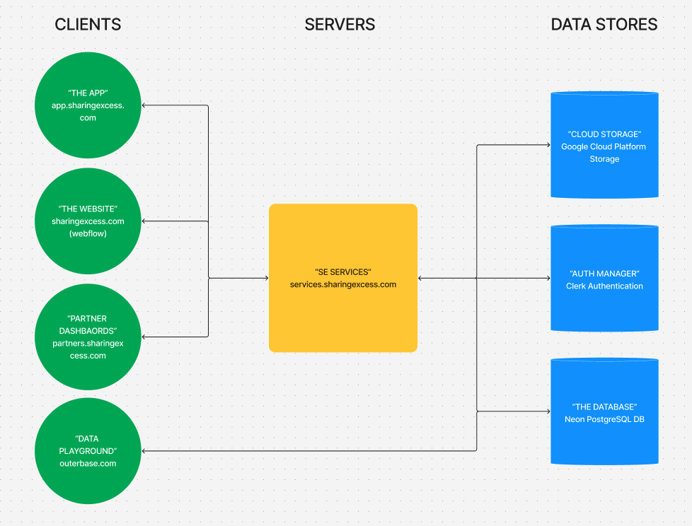

# Hey There! We're Sharing Excess, and we're building software to solve scarcity with surplus.

Sharing Excess is a nonprofit organization based in Philadelphia, PA. We work to fight food insecurity around the country by solving the last mile problem for surplus food from frams, wholesalers, grocery stores, and restaurants. We source, rescue, and redistribute food to local partners, and have delivered over 70,000,000 lbs. of food since 2018.

## Current Contributors

Tech @ Sharing Excess is a team of volunteers, students, and part and full-time contributors working to build tools that enable SE to create impact across the country. We work hard to build a community based on collaborative learning, constant exploration, and easy-to-read code that makes it easy for new folks to jump in and help.

[@ryanmarshallmc](https://github.com/ryanmarshallc)
[@shashanoid](https://github.com/shashanoid)

## The SE Platform

Our tech platform consists of a number of data systems, servers, and web + mobile based clients that allow the SE team to rescue food around the clock, around the country. Here's a basic (and hopefully current) map of the system (updated August 2024):

View the system architecture in [Figma](https://www.figma.com/board/A3F4g1bKS3iPit9UhfbpuI/SE-Tech---System-Architecture?node-id=0%3A1&t=s7QtRaC8GjB2v1Ah-1)

## Tools we use

First and foremost, we are a Javascript + Typescript shop, for the front and back end. Our current system is comprised of individual code repositories for each frontend client, including our main "app" ([app.sharingexcess.com](https://github.com/sharingexcess/app.sharingexcess.com)), and our partner dashboards ([partners.sharingexcess.com](https://partners.sharingexcess.com)).

Our frontend apps use [React](https://react.dev) (currently v18), built and packaged using [Vite](https://vitejs.dev) (and specifically [VitePWA](https://vite-pwa-org.netlify.app) for mobile native install and offline support). We use [Chakra UI](https://v2.chakra-ui.com) as our primary UI library, and [Clerk](https://clerk.com) for user management and authentication. We deploy to [Firebase Hosting](https://firebase.google.com/docs/hosting) using [Github Actions](https://docs.github.com/en/actions), and monitor errors using [Sentry](https://sentry.io).

Our backend tooling all currently exists within our [data-services](https://github.com/sharingexcess/data-services) repository. This contains code for our primary [Express](https://expressjs.com) API (services.sharingexcess.com), our cron-job services, and our database configuration, all written in Typescript and Node. Our API and cron-jobs are deployed in a serverless setup with [Firebase Functions](https://firebase.google.com/docs/functions) and [Firebase Hosting](https://firebase.google.com/docs/hosting) using [Github Actions](https://docs.github.com/en/actions). Our PostgreSQL database is configured with [Drizzle ORM](https://orm.drizzle.team) for schema and connection management, and hosted with [Neon](https://neon.tech). We also use [Zod](https://zod.dev) for Typescript type definition and checking, and [Clerk](https://clerk.com) for user management and authentication.
