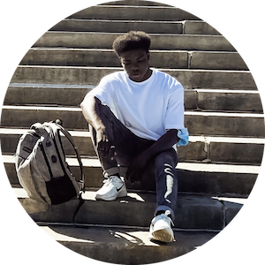

# Hey There! We're Sharing Excess, and we're building software to solve scarcity with surplus.

Sharing Excess is a nonprofit organization based in Philadelphia, PA. We're a young startup team working to fight food insecurity in our local community by solving the last mile problem for surplus food from wholesale markets, grocery stores, and restaurants. We source, rescue, and redistribute food to local partners, and have delivered over 3,000,000 lbs. of food since 2018.

## Who We Are

Tech @ Sharing Excess is a scrappy team of volunteers, students, and open source contributors working to build tools that make real impact. We work hard to build a community based on collaborative learning, constant exploration, and easy-to-read code that makes it easy for new folx to jump in and help.
\
&nbsp;

## Current Contributors

|    |  |
| :-----------------: | :---------------: |
|    Ryan McHenry     |     Luke Shin     |
| Technology Director |  Project Manager  |

\
&nbsp;
|  |  |  |
| :---------------: | :---------------------: | :-----------------------: |
| Sam Nguyen | Armando Parra | Abdullah Dawud-Sulaiman |
| Software Engineer | Software Engineer | Software Engineer |
